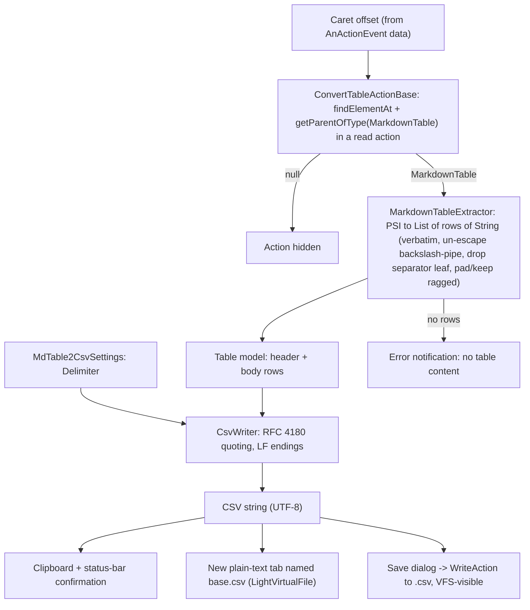

# feat: Markdown Table to CSV

## Summary

Add an editor context-menu action group that converts the GFM Markdown table under the caret to CSV, with three sinks — copy to clipboard, open in a new editor tab, and save to a `.csv` file. The conversion is a pure, unit-testable core (PSI → row/cell model → RFC 4180 CSV) wired into IDE actions and a single persisted delimiter preference.

---

## Problem Frame

Getting tabular data *out of* Markdown is manual today: hand-converting pipes to commas, fixing quoting, un-escaping characters. The friction is small per table but recurring, and it happens inside the editor where the author already is. This plan implements the in-editor conversion defined in the origin brainstorm (see origin: `docs/brainstorms/2026-05-29-markdown-table-to-csv-requirements.md`).

---

## Requirements

Carried from the origin requirements doc; grouped by concern. R-IDs match the origin.

**Activation**

- R1. The plugin contributes an action group to the editor context (right-click) menu, **hidden** when the caret is not inside a GFM Markdown table (hidden, not greyed-out, to avoid cluttering the popup elsewhere).
- R2. Activation works in any file the bundled Markdown plugin parses as containing tables (e.g. `.md`, `.markdown`).

**Conversion model**

- R3. Header row and all body rows are converted; the alignment/separator row (`|---|`) is excluded.
- R4. Cell text is verbatim, with one normalization: escaped pipe `\|` becomes literal `|`. Inline formatting, `<br>`, and inline HTML are emitted as literal source text.
- R5. An empty cell produces an empty field.
- R6. Rows with fewer cells than the header are padded with empty trailing fields to header width; rows with more cells keep all of them; no content is dropped.

**Serialization**

- R7. Fields are joined with the configured delimiter using RFC 4180 quoting: quote a field only when it contains the delimiter, a double quote, CR, or LF; double any embedded quote.
- R8. Output is UTF-8 text.

**Output targets**

- R9. Copy to clipboard, with a status-bar confirmation that the copy happened.
- R10. Open the CSV in a new in-memory editor tab named `<base>.csv` (rendered as plain text — see KTD on file type), no disk write. Each invocation opens a fresh tab.
- R11. Save to file via a save dialog defaulting to a `<base>.csv` name; the written file becomes visible in the Project view.

**Delimiter preference**

- R12. A single persisted delimiter preference — comma, semicolon, or tab — default comma; all actions use it.
- R13. The preference is editable from Settings (under Tools).

**Feedback & failure** *(added during plan review — interaction completeness)*

- R14. Each action shows user-visible feedback: success confirmation for Copy; an IDE error notification/dialog when conversion yields no rows or when a file write fails. No action fails silently.

---

## Key Technical Decisions

- **Pure conversion core, separate from IDE wiring.** The table→CSV path is split into a PSI-free serializer (`csv/CsvWriter`) operating on `List<List<String>>` and a PSI extractor (`table/MarkdownTableExtractor`). This keeps RFC 4180 quoting and ragged-row logic fully unit-testable without a running IDE, and confines platform coupling to the extractor and actions.
- **Caret→table resolution lives in the action base, not a separate class.** Resolution is two calls (`findElementAt` + `PsiTreeUtil.getParentOfType(..., MarkdownTable::class)`); it is a private helper on `ConvertTableActionBase` rather than its own file/abstraction, since it has exactly one caller. (Plan-review simplification; resolves the deferred caret-resolution question.)
- **Action threading: BGT, reading caret/PSI from the event, not EDT models.** Actions override `getActionUpdateThread()` to `BGT`. `update()` reads `CommonDataKeys.EDITOR`/`PSI_FILE`/`CARET` from the `AnActionEvent`, captures the caret **offset** from the event data, then wraps only the `PsiTreeUtil` resolution in a read action. It must not touch the EDT-only caret model off-thread (that throws a threading assertion). (Resolves a plan-review feasibility gap.)
- **Open-in-tab is a plain-text scratch buffer, not a CSV-typed file.** The base platform registers no `.csv` `FileType`, and adding a CSV-language plugin dependency for syntax highlighting is out of scope per the brainstorm (no CSV tooling). The tab is a `LightVirtualFile` named `<base>.csv` whose content is the CSV text; it renders as plain text. Tests assert the **document text**, not a CSV file type. (Resolves a plan-review feasibility gap; keeps scope tight.)
- **Line endings: LF (`\n`) everywhere.** Clipboard, in-editor tab, and saved file all use LF, so the three sinks produce identical bytes. (Resolves the origin's deferred line-ending question.) Trade-off: RFC 4180 and Windows Excel nominally expect CRLF; a CRLF option is recorded under Deferred to Follow-Up Work rather than built now.
- **Delimiter as an application-level setting, under Tools.** A `PersistentStateComponent` application service stores the delimiter; a `Configurable` registered under the **Tools** group exposes it with **radio buttons** (three short mutually-exclusive options → radio per JetBrains UI convention). Application scope (not per-project) matches the brainstorm's set-and-forget intent. (Resolves the deferred settings-scope/location and widget questions.)
- **`Delimiter` modeled as an enum.** `Delimiter { COMMA(','), SEMICOLON(';'), TAB('\t') }` carries the char and a display label; both the serializer and the settings UI consume it, avoiding stringly-typed delimiters.
- **Save filename derived from the source document.** Default the save dialog name to `<sourceBaseName>.csv` (editing `README.md` → `README.csv`), falling back to `table.csv` when the source has no name. The derivation lives in a named, directly-testable helper. (Resolves the deferred filename question.)
- **Three concrete actions share an abstract base.** `ConvertTableActionBase` centralizes `update()` gating and the extract→serialize build; the three sinks subclass it. Inheritance (over a free `buildCsv()` function) is the natural fit because each sink is itself an `AnAction` the platform instantiates from `plugin.xml`.

> Markdown PSI specifics: the extractor targets `org.intellij.plugins.markdown.lang.psi.impl.MarkdownTable` and siblings; rows come from `getHeaderRow()` plus `getRows(false)` (the `|---|` separator is a `MarkdownTableSeparatorRow` **leaf**, already excluded from `getRows`). Exact accessor signatures are confirmed against the resolved 2025.2 SDK at implementation time (see Risks), but the boolean arg on `getRows` and the leaf-typed separator are the two details most likely to trip a first pass.

---

## High-Level Technical Design

Conversion pipeline and the components that feed it:



---

## Output Structure

New code lives under the existing `com.helgesverre.mdtable2csv` package. The extractor and actions are the only platform-coupled files; `csv/` is pure Kotlin.

```
src/main/kotlin/com/helgesverre/mdtable2csv/
├── csv/
│   ├── Delimiter.kt                 # enum: comma / semicolon / tab
│   └── CsvWriter.kt                 # List<List<String>> + Delimiter -> CSV (RFC 4180, LF)
├── table/
│   └── MarkdownTableExtractor.kt    # MarkdownTable PSI -> List<List<String>>
├── settings/
│   ├── MdTable2CsvSettings.kt       # PersistentStateComponent app service
│   └── MdTable2CsvConfigurable.kt   # Settings UI (Kotlin UI DSL, radio buttons, under Tools)
├── actions/
│   ├── ConvertTableActionBase.kt    # update() gating + caret->table + build CSV
│   ├── CopyTableAsCsvAction.kt      # R9
│   ├── OpenTableAsCsvAction.kt      # R10
│   └── SaveTableAsCsvAction.kt      # R11, R14
└── MdTable2CsvBundle.kt             # exists
src/main/resources/META-INF/plugin.xml                  # register actions group + applicationConfigurable
src/main/resources/messages/MdTable2CsvBundle.properties # action labels, descriptions, feedback strings
src/test/kotlin/com/helgesverre/mdtable2csv/
├── csv/CsvWriterTest.kt
├── table/MarkdownTableExtractorTest.kt
└── actions/ConvertTableActionTest.kt
```

The per-unit `Files` lists below are authoritative; the tree is the expected shape, adjustable if implementation reveals a better layout.

---

## Implementation Units

### U1. CSV serialization core

- **Goal:** A PSI-free serializer that turns a table model into an RFC 4180 CSV string, plus the `Delimiter` enum.
- **Requirements:** R7, R8.
- **Dependencies:** none.
- **Files:** `src/main/kotlin/com/helgesverre/mdtable2csv/csv/Delimiter.kt`, `src/main/kotlin/com/helgesverre/mdtable2csv/csv/CsvWriter.kt`, `src/test/kotlin/com/helgesverre/mdtable2csv/csv/CsvWriterTest.kt`.
- **Approach:** `CsvWriter.write(rows: List<List<String>>, delimiter: Delimiter): String`. Quote a field iff it contains the delimiter char, `"`, `\r`, or `\n`; escape embedded `"` as `""`. Join fields with the delimiter, rows with `\n`, no trailing newline (tested either way — pick and assert). `Delimiter` holds `char` + display label.
- **Execution note:** Implement test-first — this is pure logic and the RFC 4180 edge cases are the correctness core.
- **Patterns to follow:** plain Kotlin; no platform imports in this package.
- **Test scenarios:**
  - Covers AE1. Field `a, b` with comma delimiter → `"a, b"`; field `say "hi"` → `"say ""hi"""`; plain word → unquoted.
  - Covers AE5. With semicolon delimiter, a field containing `;` is quoted; a field containing `,` is not.
  - Field containing a newline → quoted, newline preserved inside quotes.
  - Empty field → empty (unquoted); a row of all-empty fields → delimiters only.
  - Tab delimiter: a field containing a tab is quoted.
  - Row joining uses `\n`; multi-row output has no stray quoting; no/expected trailing newline asserted.
- **Verification:** `CsvWriterTest` passes; no IDE fixture required for this unit.

### U2. Markdown table PSI extractor

- **Goal:** Convert a `MarkdownTable` PSI element into `List<List<String>>` (header first, then body rows) with verbatim cells, `\|`→`|`, separator excluded, and ragged-row handling.
- **Requirements:** R3, R4, R5, R6.
- **Dependencies:** none (consumes PSI, produces the model U1 serializes).
- **Files:** `src/main/kotlin/com/helgesverre/mdtable2csv/table/MarkdownTableExtractor.kt`, `src/test/kotlin/com/helgesverre/mdtable2csv/table/MarkdownTableExtractorTest.kt`.
- **Approach:** Obtain rows via `getHeaderRow()` plus `getRows(false)`; the `|---|` separator is a `MarkdownTableSeparatorRow` leaf and is already excluded from `getRows`, so no manual filtering of it is needed (confirm the accessor signatures against the SDK at implementation). For each cell, take its source text, trim surrounding cell-padding whitespace, and replace `\|` with `|`. Pad short rows to header width with `""`; keep extra cells on long rows. Leave all other characters (formatting, `<br>`, HTML) untouched.
- **Patterns to follow:** `PsiTreeUtil` for child traversal; `BasePlatformTestCase` / `myFixture.configureByText` with a `.md` file to build real PSI in tests. Mirror the existing smoke test in `src/test/kotlin/com/helgesverre/mdtable2csv/MdTable2CsvPluginTest.kt`.
- **Test scenarios:**
  - Header + two body rows → 3 model rows; separator row absent from output.
  - Covers AE2. Cell authored `A \| B` → model value `A | B`.
  - Covers AE3. Cell `**bold** <br> more` → model value `**bold** <br> more` (single string, no newline introduced).
  - Covers AE4. 3-column header: a 2-cell row → 3 fields (last empty); a 4-cell row → 4 fields.
  - Empty cell → empty string in the model.
  - Cell with leading/trailing spaces in source → padding trimmed, inner content preserved.
- **Verification:** `MarkdownTableExtractorTest` passes against fixture-parsed Markdown; exact PSI accessor names confirmed during implementation.

### U3. Delimiter setting + Settings UI

- **Goal:** Persist the delimiter application-wide and expose it in Settings under Tools.
- **Requirements:** R12, R13.
- **Dependencies:** U1 (uses `Delimiter`).
- **Files:** `src/main/kotlin/com/helgesverre/mdtable2csv/settings/MdTable2CsvSettings.kt`, `src/main/kotlin/com/helgesverre/mdtable2csv/settings/MdTable2CsvConfigurable.kt`, `src/main/resources/META-INF/plugin.xml` (register the `applicationConfigurable` with `parentId="tools"`), `src/main/resources/messages/MdTable2CsvBundle.properties`.
- **Approach:** `MdTable2CsvSettings` is a `@Service(Service.Level.APP)` `PersistentStateComponent` storing the selected `Delimiter` (default `COMMA`). `MdTable2CsvConfigurable` (Kotlin UI DSL `BoundConfigurable`) renders a `buttonsGroup` of three radio buttons bound to the setting.
- **Patterns to follow:** standard `PersistentStateComponent` + `applicationConfigurable` extension point; Kotlin UI DSL v2 (`panel { buttonsGroup { row { radioButton(...) } } }`).
- **Test scenarios:**
  - Default delimiter is comma when no state is persisted.
  - Setting a value and reloading the service returns the persisted value.
  - Test expectation: the Configurable UI itself is exercised manually via `runIde`; the persistence round-trip is unit-tested.
- **Verification:** delimiter persists across service reload in test; the setting appears under Settings → Tools when run via `runIde`.

### U4. Action base: caret resolution + gating + CSV build

- **Goal:** An abstract action that resolves the enclosing table at the caret, gates visibility, and builds the CSV from caret + settings for subclasses.
- **Requirements:** R1, R2 (and wires R12 into the conversion).
- **Dependencies:** U1, U2, U3.
- **Files:** `src/main/kotlin/com/helgesverre/mdtable2csv/actions/ConvertTableActionBase.kt`, `src/test/kotlin/com/helgesverre/mdtable2csv/actions/ConvertTableActionTest.kt`.
- **Approach:** Abstract `AnAction` with `getActionUpdateThread() = BGT`. `update()` reads editor/PSI-file and the caret **offset** from `AnActionEvent` data keys, then resolves the innermost `MarkdownTable` inside a read action via `findElementAt` + `PsiTreeUtil.getParentOfType`; sets `isEnabledAndVisible` to non-null (hidden when null, per R1). A protected helper resolves the table again in `actionPerformed`, runs extractor (U2) → writer (U1) with the current delimiter (U3), and returns the CSV string or null. Subclasses implement only the sink.
- **Patterns to follow:** `AnActionEvent` data keys (`CommonDataKeys.EDITOR`, `PSI_FILE`, `CARET`); read-action wrapping for all PSI access; never read the live caret model on the BGT thread.
- **Test scenarios:**
  - Caret inside a table in a `.md` file → action enabled and visible.
  - Covers R2. Caret inside a table in a `.markdown` file → action enabled (confirms the file-type association covers both extensions).
  - Caret in plain prose / outside any table → action hidden.
  - Caret in a non-Markdown file → hidden.
  - Build helper returns the expected CSV string for a caret inside a known table (integration of U1+U2+U3).
- **Verification:** `ConvertTableActionTest` proves gating across `.md`/`.markdown`/non-table/non-markdown and the end-to-end CSV string for a fixture table.

### U5. Three sink actions + feedback + menu registration

- **Goal:** Implement the clipboard / open-tab / save-file actions with user feedback and error handling, and register the group in the editor popup menu.
- **Requirements:** R9, R10, R11, R14 (and R1 menu placement).
- **Dependencies:** U4.
- **Files:** `src/main/kotlin/com/helgesverre/mdtable2csv/actions/CopyTableAsCsvAction.kt`, `src/main/kotlin/com/helgesverre/mdtable2csv/actions/OpenTableAsCsvAction.kt`, `src/main/kotlin/com/helgesverre/mdtable2csv/actions/SaveTableAsCsvAction.kt`, `src/main/resources/META-INF/plugin.xml` (action `<group>` under `EditorPopupMenu`), `src/main/resources/messages/MdTable2CsvBundle.properties`.
- **Approach:**
  - **Copy (R9):** `CopyPasteManager.getInstance().setContents(StringSelection(csv))`, then a transient status-bar message (e.g. via `WindowManager`/`StatusBar.info`) confirming "Table copied as CSV". No balloon/dialog.
  - **Open (R10):** create a `LightVirtualFile("<base>.csv", csv)` (plain text; no CSV file-type dependency) and open via `FileEditorManager.getInstance(project).openFile(...)`. Each invocation opens a new tab (no reuse) — intentional, so the user can compare versions.
  - **Save (R11):** `FileChooserFactory.getInstance().createSaveFileDialog(...)`; default name from a `deriveDefaultFilename(sourceFile): String` helper (`<base>.csv`, fallback `table.csv`). On confirm, write inside a `WriteAction` via VFS (so the new file is visible in the Project view) in UTF-8; guard the null `VirtualFileWrapper` when the user cancels.
  - **Errors (R14):** when the build helper returns no rows, show an IDE notification ("No table content found at caret"); on a save `IOException`, show `Messages.showErrorDialog` with the cause. No silent failures.
  - **Menu:** register the three under a single `<group>` titled "Markdown Table → CSV" (label + per-action labels from the bundle), added at the end of `EditorPopupMenu`, item order Copy → Open → Save.
- **Action labels (bundle keys, authoritative):** group "Markdown Table → CSV"; "Copy as CSV"; "Open in New CSV Tab"; "Save as CSV File…". Each with a one-line description for action search.
- **Patterns to follow:** `CopyPasteManager`, `LightVirtualFile`, `FileEditorManager`, `FileChooserFactory`/`FileSaverDialog`, `WriteAction`/`VfsUtil`, `Notifications`/`Messages`; bundle-driven text via `MdTable2CsvBundle`.
- **Test scenarios:**
  - Copy action places expected CSV on the clipboard (assert via `CopyPasteManager` in fixture).
  - Open action opens a file named `<base>.csv` whose **document text** equals the CSV (assert via `FileEditorManager`; do not assert a CSV file type).
  - `deriveDefaultFilename` returns `<base>.csv` for a named source and `table.csv` for an unnamed/null source (direct unit test).
  - Empty/zero-row conversion path triggers the error-notification branch (assert the no-rows guard, not the native UI).
  - Test expectation: the native save dialog and status-bar/notification UI are exercised via `runIde`; the filename-derivation, CSV-build, and no-rows guard are unit-tested directly.
  - Menu group is present in `EditorPopupMenu` and items are hidden outside a table (reuses U4 gating).
- **Verification:** actions appear under the right-click submenu inside a table when run via `runIde`; clipboard/open behaviors and `deriveDefaultFilename` covered by fixture/unit tests; save write-path smoke-checked via `runIde`.

---

## Scope Boundaries

**Deferred for later** (carried from origin)

- Bulk export of every table in a file at once (and multi-file / zip output).
- A "strip formatting to plain text" cell mode as an alternative to verbatim.

**Outside this product's identity** (carried from origin)

- Reverse conversion (CSV → Markdown) and importing/opening external CSV files.
- Spreadsheet-like editing of the table or CSV.
- A CSV-language/file-type dependency for syntax-highlighting the opened tab.

**Deferred to Follow-Up Work** (plan-local)

- CRLF line-ending option for the saved `.csv` (relevant to Windows Excel in a `;`-locale). LF ships first; a per-output line-ending choice can extend the delimiter setting later.
- A BOM option for Excel UTF-8 detection, if real-world use shows it's needed.

---

## Risks & Dependencies

- **Markdown PSI API drift.** The bundled Markdown plugin's table PSI (class package, `getHeaderRow`/`getRows(boolean)` accessors, `MarkdownTableSeparatorRow` leaf type) has shifted across platform versions. Mitigation: the extractor (U2) is the only place that depends on these names, it is covered by fixture tests, and exact accessors are verified against the resolved 2025.2 SDK during implementation. (API shapes were spot-checked against a bundled `markdown.jar` during planning and matched; still confirm on 2025.2.)
- **Bundled-plugin dependency.** Conversion requires `org.intellij.plugins.markdown`, already declared in `build.gradle.kts` and `src/main/resources/META-INF/plugin.xml`. Markdown is bundled in IDEA Community and Ultimate; no marketplace dependency.
- **First build downloads the platform SDK.** `./gradlew check` / `runIde` fetches the 2025.2 IntelliJ distribution on first run (minutes, network-dependent).

---

## Sources / Research

- IntelliJ Platform SDK — PSI navigation (`PsiFile.findElementAt`, `PsiTreeUtil.getParentOfType`): https://plugins.jetbrains.com/docs/intellij/navigating-psi.html
- Action system / `EditorPopupMenu` group registration, `update()` gating, and `getActionUpdateThread`: https://plugins.jetbrains.com/docs/intellij/basic-action-system.html , https://plugins.jetbrains.com/docs/intellij/action-system.html
- Persisting state (`PersistentStateComponent`) and Settings (`Configurable`, Kotlin UI DSL): https://plugins.jetbrains.com/docs/intellij/persisting-state-of-components.html , https://plugins.jetbrains.com/docs/intellij/settings.html
- Virtual files & write actions (`LightVirtualFile`, `WriteAction`, VFS): https://plugins.jetbrains.com/docs/intellij/virtual-file.html
- Origin requirements: `docs/brainstorms/2026-05-29-markdown-table-to-csv-requirements.md`
- Bundled Markdown plugin id `org.intellij.plugins.markdown` — declared in `build.gradle.kts`, `src/main/resources/META-INF/plugin.xml`.
